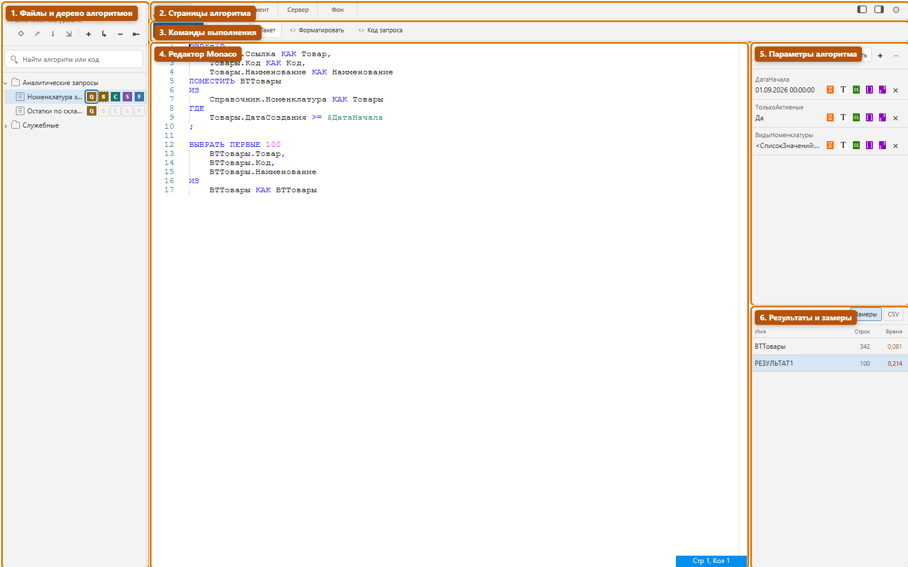
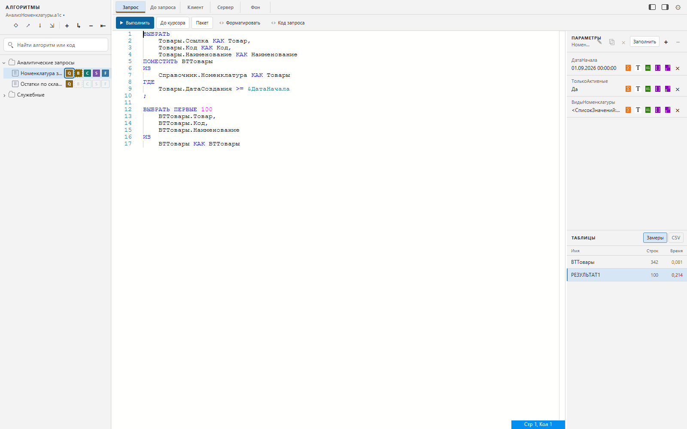
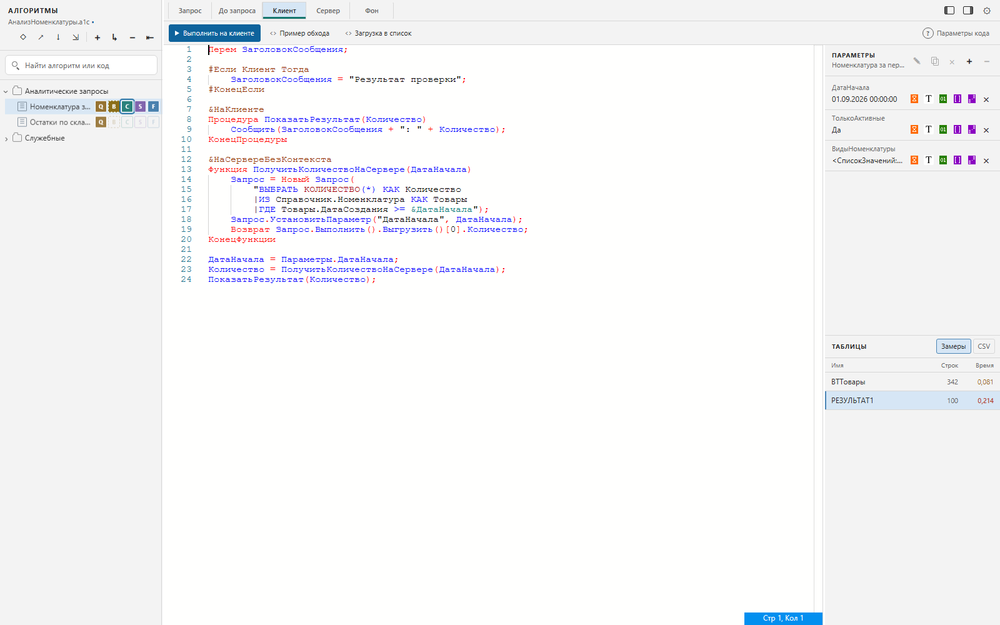
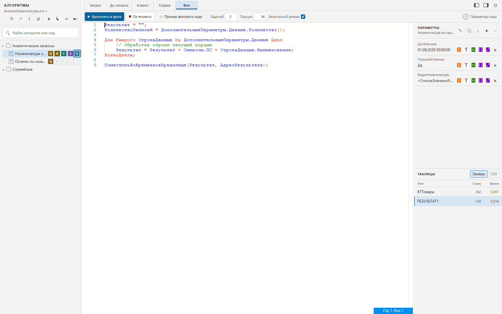
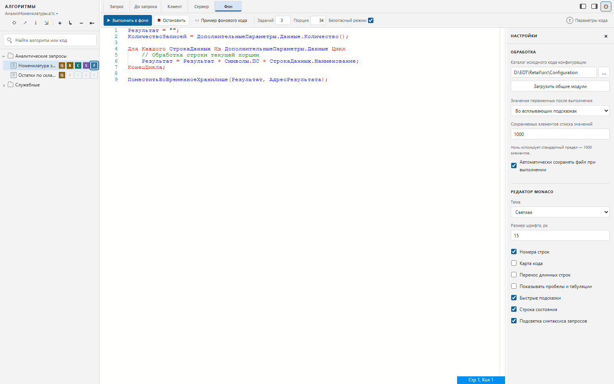

# DataConsole83: руководство пользователя

Руководство актуально для DataConsole83 5.0.10. Оно описывает рабочую область Monaco, консоль запросов и выполнение BSL-кода на клиенте, сервере и в фоне.

## Назначение

DataConsole83 помогает исследовать данные информационной базы и хранить повторно используемые сценарии в виде дерева алгоритмов. Каждый алгоритм объединяет запрос, подготовительный код, клиентский и серверный BSL-код, фоновую обработку и собственные параметры.

> **Внимание:** консоль выполняет произвольный BSL-код с правами текущего пользователя. Серверный и фоновый код может изменять данные информационной базы. Перед выполнением проверяйте текст, используйте тестовую базу и сохраняйте безопасный режим фоновых заданий. Не запускайте неизвестные файлы алгоритмов.

## Быстрый старт

1. Откройте внешнюю обработку `DtCons83Monaco`.
2. Создайте новый файл алгоритмов или откройте существующий файл `*.a1c`.
3. Добавьте алгоритм кнопкой `+` в панели «АЛГОРИТМЫ».
4. Выберите страницу алгоритма: «Запрос», «До запроса», «Клиент», «Сервер» или «Фон».
5. Для запроса добавьте параметры в правой панели или нажмите «Заполнить».
6. Выполните нужную команду над редактором.
7. Сохраните рабочую область через `Ctrl+S`.



На первом снимке выделены основные функциональные блоки:

1. **Файлы и дерево алгоритмов** — создание, открытие и сохранение `*.a1c`, поиск и управление вложенными алгоритмами.
2. **Страницы алгоритма** — переключение между запросом, подготовкой, клиентским, серверным и фоновым кодом.
3. **Команды выполнения** — набор действий меняется в зависимости от открытой страницы.
4. **Редактор Monaco** — ввод, навигация, форматирование и диагностика текста.
5. **Параметры алгоритма** — значения для запроса, клиентского и серверного кода.
6. **Результаты и замеры** — итоговые и временные таблицы, число строк и время выполнения.

## Рабочая область

### Файлы алгоритмов

Панель «АЛГОРИТМЫ» содержит команды:

| Команда | Назначение |
|---|---|
| Новый файл | Создать пустую рабочую область. При несохранённых изменениях выводится предупреждение. |
| Открыть | Открыть файл алгоритмов `*.a1c`. Открытие доступно и в режиме просмотра. |
| Сохранить | Записать изменения в текущий файл. Для нового файла открывается диалог выбора имени. |
| Сохранить как | Записать рабочую область в другой файл. |

Файл `*.a1c` хранит дерево алгоритмов, тексты всех пяти страниц и значения параметров. Изменённый файл помечается в интерфейсе. При закрытии обработки с несохранёнными изменениями появляется предупреждение.

### Дерево алгоритмов

Доступны следующие операции:

- добавить алгоритм рядом с текущим;
- добавить вложенный алгоритм;
- переименовать выбранный алгоритм повторным щелчком или клавишей `F2`;
- удалить алгоритм вместе с дочерними алгоритмами и их параметрами;
- свернуть всё дерево;
- раскрывать и сворачивать отдельные ветви;
- искать по имени алгоритма, тексту его документов, имени, типу и представлению параметров;
- очистить поиск кнопкой `×` или клавишей `Esc`.

После повторного открытия формы восстанавливается выбранный алгоритм. Кнопки `Q`, `B`, `C`, `S`, `F` у строки дерева сразу открывают соответствующий документ.

### Страницы алгоритма

| Страница | Что содержит | Основная команда |
|---|---|---|
| Запрос | Текст языка запросов 1С | Выполнить запрос |
| До запроса | BSL-код подготовки параметров и временных таблиц | Выполнить запрос с подготовкой |
| Клиент | BSL-код в клиентском контексте формы | Выполнить на клиенте |
| Сервер | BSL-код на сервере | Выполнить на сервере |
| Фон | Код обработчика порции данных | Выполнить в фоновых заданиях |

Если у алгоритма заполнено несколько страниц, между ними можно переключаться вкладками над редактором или кнопками в дереве.

## Редактор Monaco

Редактор предоставляет:

- подсветку BSL и языка запросов 1С;
- подсказки по ключевым словам, глобальному контексту, типам и метаданным;
- подсказки сигнатур методов;
- сниппеты с заполняемыми позициями;
- переход к определению по `F12` и просмотр определения по `Ctrl+F12`;
- поиск и замену средствами Monaco;
- форматирование BSL через `Alt+Shift+F`;
- форматирование текста запроса отдельной командой «Форматировать»;
- добавление и удаление комментария через контекстное меню;
- закладки: `Alt+F2` устанавливает или удаляет закладку, `F2` переходит к следующей, когда фокус находится в редакторе;
- сворачивание блоков, подсветку парных скобок, карту кода и строку состояния;
- отдельную модель и позицию курсора для каждого документа алгоритма;
- отображение ошибки на исходной строке кода.

Контекстное меню редактора дополнительно содержит:

- «Конструктор запроса...» — для страницы запроса;
- «Конструктор форматной строки...» — для BSL;
- «Добавить/удалить комментарий»;
- «Добавить перенос строки» и «Удалить перенос строки»;
- «Форматировать»;
- команды закладок.

## Параметры алгоритма

Параметры принадлежат выбранному алгоритму. Они используются как параметры запроса и собираются в структуру `Параметры` при выполнении клиентского или серверного кода.

В правой панели можно:

- добавить или удалить параметр;
- изменить выбранное значение кнопкой с карандашом, двойным щелчком или `Enter`;
- быстро установить дату, многострочную строку, число формата `15,5`, `СписокЗначений` или произвольное допустимое значение;
- очистить значение до `Неопределено`;
- скопировать параметр кнопкой или клавишей `F9` вместе со значением;
- автоматически найти параметры `&ИмяПараметра` в тексте запроса кнопкой «Заполнить».

Копии получают имена `ИмяКопия`, `ИмяКопия2` и далее. Имя параметра должно быть уникальным внутри алгоритма без учёта регистра.

При отмене диалога редактирования старое значение сохраняется. Для явной установки `Неопределено` используйте команду очистки.



## Выполнение запроса

Страница «Запрос» поддерживает:

| Команда | Поведение |
|---|---|
| Выполнить | Выполняет выделенный фрагмент. Если выделения нет, выполняет весь текст. |
| До курсора | Временно выделяет текст от начала документа до курсора и выполняет его. |
| Пакет | Выполняет пакет запросов и выводит итоговые и временные таблицы по частям пакета. |
| Форматировать | Переключает представление между чистым текстом запроса и строкой BSL с `|` и экранированными кавычками. |
| Код запроса | Формирует BSL-код создания объекта `Запрос` и установки его текста. |
| Конструктор запроса | Открывает штатный конструктор 1С и возвращает изменённый текст в редактор. |

`F5` из любой части рабочей области переключается на запрос выбранного алгоритма и выполняет его. `Ctrl+F5` сохраняет штатное назначение «выполнить до курсора», если команда доступна клиенту 1С.

Перед выполнением значения из панели параметров устанавливаются в запрос. Результат выводится в нижнюю таблицу формы. Для запроса с `ИТОГИ` результат может быть показан как дерево.

### Код «До запроса»

Код этой страницы выполняется на сервере непосредственно перед основным запросом. Ему доступны:

| Переменная | Тип | Назначение |
|---|---|---|
| `ПараметрыЗапроса` | `Соответствие` | Текущие параметры запроса. Можно добавить или заменить рассчитанные значения. |
| `МенеджерВременныхТаблиц` | `МенеджерВременныхТаблиц` | Общий менеджер основного запроса. Позволяет заранее создать временные таблицы. |

Кнопка «Выполнить запрос» на странице «До запроса» запускает не только подготовительный код, а весь запрос алгоритма.

Пример вычисляемого параметра:

```bsl
ПараметрыЗапроса.Вставить("НачалоДня", НачалоДня(ТекущаяДата()));
```

## Выполнение BSL-кода

### Доступный контекст

На страницах «Клиент» и «Сервер» доступны:

| Переменная | Назначение |
|---|---|
| `Выгрузка` | Табличный результат последнего запроса. |
| `ВыгрузкаДерево` | Древовидный результат запроса с итогами. |
| `Параметры` | Структура параметров выбранного алгоритма. |
| `Значения` | Таблица параметров формы; доступна в полном временном модуле для расширенных сценариев. |
| `ТекущийАлгоритм` | УИД выполняемого алгоритма. |

Пример обработки результата запроса:

```bsl
Для Каждого СтрокаРезультата Из Выгрузка Цикл
	Сообщить(СтрокаРезультата);
КонецЦикла;
```

Пример обращения к параметру:

```bsl
Если Параметры.Свойство("ДатаНачала", ДатаНачала) Тогда
	Сообщить(ДатаНачала);
КонецЕсли;
```

### Клиентский код

Команда «Выполнить на клиенте» запускает весь документ в клиентском контексте. Подходящие задачи:

- показ диалогов и сообщений;
- работа с клиентскими API платформы;
- обработка и представление полученной выборки;
- подготовка значений параметров для последующих запусков.



#### Поддерживаемые конструкции

Клиентская страница принимает обычные линейные операторы BSL и объявления уровня модуля:

| Конструкция | Поддержка и назначение |
|---|---|
| Линейные операторы | Присваивания, условия, циклы, вызовы процедур и функций выполняются по порядку. |
| `Перем` | Объявляет переменную временного модуля. Английский вариант — `Var`. |
| `Процедура`, `Функция` | Объявляет методы, которые можно вызвать из линейной части или других методов. Поддерживаются также `Асинх Процедура` и `Асинх Функция`. Английские варианты тоже распознаются. |
| `&НаКлиенте` | Явно задаёт клиентский метод. Служебная точка входа консоли также создаётся на клиенте. |
| `&НаСервере` | Задаёт серверный метод формы с контекстом. Вызов из клиентского кода выполняет клиент-серверный переход по правилам платформы. |
| `&НаСервереБезКонтекста` | Задаёт серверный метод без передачи контекста формы. Передавайте нужные значения аргументами. |
| `#Если`, `#ИначеЕсли`, `#Иначе`, `#КонецЕсли` | Условная компиляция. Поддерживаются русские и английские варианты инструкций препроцессора. |

Когда в документе есть `Перем`, метод, директива компиляции или условная инструкция препроцессора, консоль собирает временный модуль управляемой формы:

1. объявления процедур, функций и переменных остаются на уровне модуля;
2. линейные операторы переносятся в служебную процедуру с директивой `&НаКлиенте`;
3. процедура запускается, а ошибки компиляции и выполнения пересчитываются на строки исходного документа.

Пример одного клиентского документа с переменной модуля, условной компиляцией и вызовом серверного метода:

```bsl
Перем ЗаголовокСообщения;

#Если Клиент Тогда
	ЗаголовокСообщения = "Результат проверки";
#КонецЕсли

&НаКлиенте
Процедура ПоказатьРезультат(Количество)
	Сообщить(ЗаголовокСообщения + ": " + Количество);
КонецПроцедуры

&НаСервереБезКонтекста
Функция ПолучитьКоличествоНаСервере(ДатаНачала)
	Запрос = Новый Запрос(
		"ВЫБРАТЬ КОЛИЧЕСТВО(*) КАК Количество
		|ИЗ Справочник.Номенклатура КАК Товары
		|ГДЕ Товары.ДатаСоздания >= &ДатаНачала");
	Запрос.УстановитьПараметр("ДатаНачала", ДатаНачала);
	Возврат Запрос.Выполнить().Выгрузить()[0].Количество;
КонецФункции

ДатаНачала = Параметры.ДатаНачала;
Количество = ПолучитьКоличествоНаСервере(ДатаНачала);
ПоказатьРезультат(Количество);
```

В примере последние три строки — линейная часть, которая становится телом служебной клиентской процедуры. Серверному методу дата передаётся явно: клиентские переменные модуля не следует считать общим состоянием клиента и сервера.

Имена `Параметры` и `Parameters` во временном модуле резервируются консолью для структуры параметров алгоритма. Консоль безопасно переименовывает самостоятельные обращения к этим идентификаторам во внутреннее имя, не меняя строки, комментарии и свойства объектов.

Важные ограничения:

- выполняется весь клиентский документ; выделение текста не ограничивает запуск;
- служебная точка входа синхронная: наличие асинхронных методов не означает подтверждённой поддержки верхнеуровневого `Ждать`;
- данные для серверных методов передавайте аргументами, а результат возвращайте явно;
- доступность платформенных методов определяется типом клиента 1С и контекстом директивы;
- временная обработка должна быть разрешена политиками безопасности и антивирусом.

### Серверный код

Команда «Выполнить на сервере» запускает весь документ на сервере. Подходящие задачи:

- чтение и изменение данных информационной базы;
- использование серверных объектов платформы;
- обработка больших выборок без передачи промежуточных данных на клиент;
- заполнение `Выгрузка` и таблицы параметров `Значения`.

Изменения `Выгрузка` и `Значения`, выполненные серверным модулем, возвращаются в форму.

### Процедуры, функции и переменные модуля

Клиентская и серверная страницы поддерживают как линейный код, так и полноценные объявления:

- `Процедура` и `Функция`;
- переменные модуля через `Перем`;
- директивы компиляции, включая клиентские и серверные методы формы;
- инструкции препроцессора.

Линейные операторы становятся телом служебной точки входа, а объявления остаются методами временного модуля. Поэтому метод можно объявить в том же документе и вызвать из линейной части:

```bsl
Функция ПредставлениеСуммы(Сумма)
	Возврат Формат(Сумма, "ЧДЦ=2");
КонецФункции

Для Каждого СтрокаРезультата Из Выгрузка Цикл
	Сообщить(ПредставлениеСуммы(СтрокаРезультата.Сумма));
КонецЦикла;
```

Код с объявлениями выполняется через временную внешнюю обработку. Ошибки компиляции и выполнения привязываются к исходной строке редактора. Размер такого модуля ограничен размером встроенного шаблона — примерно 256 КБ на модуль.

### Готовые примеры

Над редактором доступны вставки:

- «Пример обхода» — цикл по `Выгрузка`;
- «Загрузка в список» — формирование `СписокЗначений` из колонки результата и запись его в параметр;
- «Из хранилища» — получение вложенного значения по служебному адресу;
- «Пример фонового кода» — обработка порции данных с прогрессом и возвратом результата.

Вставка добавляется в конец текущего документа и помечает рабочую область как изменённую.

## Фоновое выполнение

Страница «Фон» разбивает текущую `Выгрузка` на порции и запускает от 1 до 10 длительных операций. В код передаётся:

| Переменная | Состав |
|---|---|
| `ДополнительныеПараметры` | Структура параметров фонового обработчика. |
| `ДополнительныеПараметры.Данные` | Массив структур строк текущей порции. |

Над редактором задаются:

- количество фоновых заданий;
- рассчитанный размер порции;
- безопасный режим;
- команды «Выполнить в фоне» и «Остановить».



Фоновый запуск возможен только в клиент-серверной информационной базе и только после получения непустой `Выгрузка`. Пока предыдущая группа заданий активна, повторный запуск блокируется. Результат задания можно поместить по переданному `АдресРезультата`; после завершения консоль выводит его сообщением.

Для запуска конфигурация должна предоставлять экспортную процедуру `ОбщегоНазначенияПереопределяемый.ВыполнитьВБезопасномРежиме`. Пример интеграции приведён в [README](../README.md#фоновое-выполнение).

Отключайте безопасный режим только для доверенного кода и при понимании последствий. Фоновое выполнение зависит от подсистемы длительных операций конкретной конфигурации.

## Результаты и временные таблицы

После запроса правая секция «ТАБЛИЦЫ» показывает каждую временную или итоговую таблицу:

- имя;
- число строк;
- длительность выполнения, если включены замеры.

Выбор строки таблицы показывает её данные в нижней части формы и переводит курсор к оператору `ПОМЕСТИТЬ`. Для итогового результата курсор устанавливается в конец запроса.

Команда «Замеры» включает время выполнения каждой части пакета. Цветовая оценка сравнивает длительность части с общей длительностью: до 10 %, от 10 до 40 % и более 40 %.

Команда `CSV` выгружает выбранную таблицу. Контекстное меню нижнего результата дополнительно позволяет:

- показать содержимое ячейки;
- узнать тип значения;
- открыть вложенную `ТаблицаЗначений` или значение из `ХранилищеЗначения`;
- очистить результат;
- загрузить выбранную колонку в параметр как `СписокЗначений`;
- сохранить или загрузить данные в `CSV`, `TXT` с табуляцией либо `dump`.

## Просмотр значений переменных

Настройка «Значения переменных после выполнения» имеет три режима:

| Режим | Результат |
|---|---|
| Не показывать | Выполнение не собирает пользовательские переменные для просмотра. |
| В отдельном окне | Под редактором открывается дерево переменных. |
| Во всплывающих подсказках | Значения показываются при наведении на имя переменной. |

Сбор выполняется для клиентского и серверного кода. Для кода с процедурами и функциями переменные собираются перед выходом из методов и после выполнения основной части. Большие или вложенные значения могут раскрываться по запросу через временное хранилище.

Кнопка «Параметры кода» над редактором показывает встроенные переменные, доступные текущей странице.

## Настройки

Кнопка с шестерёнкой открывает настройки обработки и Monaco.



### Обработка

- **Каталог исходного кода конфигурации** — корень выгрузки конфигурации в файлы. Ожидаются каталоги вида `CommonModules/<Имя>/Ext/Module.bsl`, а также стандартные каталоги объектов метаданных.
- **Загрузить общие модули** — разбирает все общие модули из `CommonModules` и добавляет их экспортные методы в подсказки. Операция может занять много времени и память.
- **Значения переменных после выполнения** — управляет просмотром переменных.
- **Сохраняемых элементов списка значений** — предполагаемый предел элементов `СписокЗначений`, записываемых в файл алгоритмов; ноль означает стандартный предел 1000. Ограничение текущей версии указано ниже.
- **Автоматически сохранять файл при выполнении** — перед выполнением сохраняет уже именованный файл `*.a1c`. Для новой рабочей области без имени автоматический диалог не открывается.

После указания каталога исходников подсказки могут динамически загружать тексты общих модулей, модулей менеджеров и модулей объектов.

### Редактор Monaco

Доступны:

- светлая и тёмная тема;
- размер шрифта от 10 до 28 px;
- номера строк;
- карта кода;
- перенос длинных строк;
- отображение пробелов и табуляций;
- быстрые подсказки;
- строка состояния;
- подсветка синтаксиса запросов внутри BSL.

Основную панель алгоритмов и дополнительную панель параметров можно скрывать независимо. Их ширина меняется перетаскиванием разделителей; двойной щелчок восстанавливает стандартную ширину.

## Горячие клавиши

| Клавиши | Действие |
|---|---|
| `F5` | Выполнить запрос выбранного алгоритма и открыть страницу «Запрос». |
| `Ctrl+F5` | Выполнить запрос до курсора, если команда доступна форме 1С. |
| `F9` | Скопировать выбранный параметр. |
| `Ctrl+S` | Сохранить файл алгоритмов. |
| `F2` | Переименовать алгоритм в дереве; в Monaco — перейти к следующей закладке. |
| `Alt+F2` | Установить или удалить закладку в Monaco. |
| `F12` | Перейти к определению. |
| `Ctrl+F12` | Показать определение. |
| `Alt+Shift+F` | Форматировать BSL-документ. |
| `Ctrl+Num /` | Добавить комментарий. |
| `Ctrl+Shift+Num /` | Удалить комментарий. |
| `Ctrl+D` | Открыть конструктор запроса из страницы «Запрос». |
| `Ctrl+L` | Удалить текущую строку в Monaco. |
| `Esc` | Закрыть диалог или очистить поиск алгоритмов, когда фокус находится в нём. |

Стандартные сочетания Monaco для поиска, замены, выделения, отмены и повтора также доступны. Часть глобальных сочетаний может перехватываться клиентом 1С.

## Ошибки и ограничения

- Работа консоли тестировалась на платформе **1С:Предприятие 8.3.27** и **БСП 3.0.1**. Совместимость с другими версиями платформы и БСП не подтверждена; поведение клиентских API, диалогов, временных внешних обработок и фоновых заданий может отличаться.
- Ошибка BSL выводится сообщением и отмечается на строке редактора. Для временного модуля номер пересчитывается к исходному документу.
- Ошибки конструктора запроса и файловых операций показываются средствами клиента 1С.
- Клиентский и серверный код выполняется целиком; выделенный фрагмент учитывается только на странице запроса.
- Фоновый режим недоступен в файловой информационной базе и зависит от БСП/реализации длительных операций конфигурации.
- Код с методами создаёт временную EPF. Антивирус, права на временный каталог или запрет внешних обработок могут помешать компиляции либо открытию.
- Значения параметров сериализуются в `*.a1c` через XDTO. Не каждый прикладной или несериализуемый тип можно восстановить в другом сеансе или другой базе.
- В версии 4.13.4 поле настройки лимита не передаётся в запись `*.a1c`: `СписокЗначений` сохраняется со стандартным пределом 1000 элементов независимо от введённого значения.
- Консоль не открывает транзакцию и не откатывает изменения автоматически.
- Результаты, адреса временного хранилища и значения переменных живут в рамках текущего сеанса формы.
- Работа конструктора, диалогов выбора значения, фоновых заданий и временной EPF зависит от целевого клиента и конфигурации 1С.
